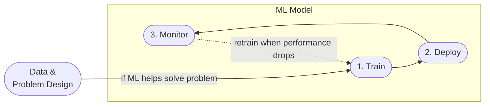

For a clearer picture, we can look at a life-cycle of a machine learning model:

```mermaid
  graph LR
    subgraph ML Model
    D([Monitor]) -.->|retrain when performance drops| B([1. Train])
    B --> C([2. Deploy]) 
    C --> D([3. Monitor])
    end
    A([Data & <br>Problem Design]) --->|if ML helps solve problem| B
```