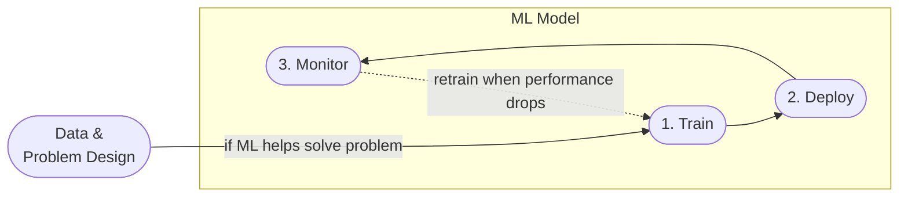

## Why?

A typical machine learning life cycle consists of data ingestion, data augmentation, modeling, training, optimizing, tracking experiments and explaining the results.

How do we track all these stages without going crazy?

MLOps is a essentially automation. It is a way of making sure we can reproduce the results from a model, we can can monitor the quality of the model, retrain the model if the quality degrades and easily (re)deploy the model.

## 🔁 ML Model Life-Cycle
For a clearer picture, we can look at a life-cycle of a machine learning model:

## MLOps Maturity model.

[[Maturity Model]]

## Components

1. [[Kubernetes]]
	1. Container runtime
2. [[Experiment Tracking and model management]]
	1. Experiment tracking
	2. Saving and loading models with MLflow
	3. Model registry
3. [[Data Versioning]]
    1. Capture versions of your data to reproduce, trace, and keep track of your ML model lineage.
4. [[Experimentation]]
	1. Sharing code and experiment result
54. [[Orchestration and ML Pipelines]]
	1.  Workflow orchestration
	2.  Turning a notebook into a pipeline
6. [[Model Deployment]]
    1. Move Models into Production
7. [[Model Monitoring]]
    1. Monitor model performance
    2. Model application performance, response times etc
8. [[Best Practices]]
    1. Testing: unit, integration
    2. Pre-commit hooks: Python: linting and formatting
    3. CI/CD (Github Actions)
    4. Infrastructure as code (Terraform)
